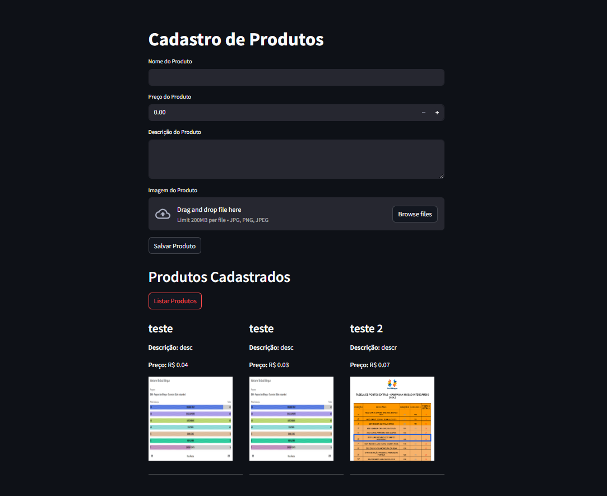

# Projeto realizado no Bootcamp Microsoft Azure Cloud Native

## 📦 Cadastro de Produtos com Streamlit, Azure Blob Storage e SQL Server

Este é um projeto web simples para cadastro de produtos, utilizando [Streamlit](https://streamlit.io/) como framework de interface, [Azure Blob Storage](https://azure.microsoft.com/en-us/products/storage/blobs) para armazenamento de imagens e [SQL Server](https://www.microsoft.com/en-us/sql-server/sql-server-downloads) como banco de dados.

## 🚀 Funcionalidades

- Cadastro de produtos com:
  - Nome
  - Descrição
  - Preço
  - Imagem
- Armazenamento de imagens no Azure Blob
- Exibição dos produtos cadastrados com visualização da imagem
- Layout adaptado com visual moderno via Streamlit

## 🛠️ Tecnologias Utilizadas

  

- [Streamlit](https://streamlit.io/)
- [Azure Blob Storage (via `azure-storage-blob`)](https://pypi.org/project/azure-storage-blob/)
- [SQL Server (via `pymssql`)](https://pymssql.readthedocs.io/en/stable/)
- [Python](https://www.python.org/)
- [dotenv (`python-dotenv`)](https://pypi.org/project/python-dotenv/)

 

  

